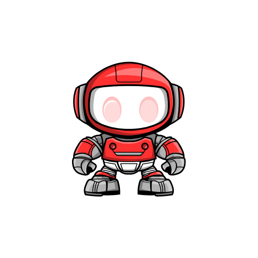

  
  <h1>My Muuri</h1>
  
Thanks for visiting my portfolio project!💬 Feel free to explore, give feedback, or connect with me through the provided links! 🚀

  

  

---

#### Found an issue?

If you encounter any issues or have suggestions, feel free to [open an issue](https://github.com/muuri19/mys-app/issues/new) on this repository. Your feedback is highly appreciated! 🚀

#### Thanks to all the contributors of my muuri app :

---

Download the app from Play Store and get started! ⬇️

